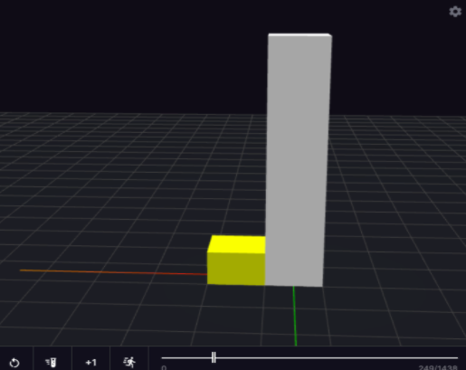

# __README__

## **Introduction**
### Kitty party allows participants to pool crypto together and get an additional interest in a short period of time. Kitty party is designed to give admins / kreators incentives to create new pools ensuring positive growth.

## **Types of pools**
### In this simulation we see the projection of how a kitty party works.We have divided the types of pools into 3 types, by the amount of coins a person contributes in the entire pool.The total pool amount of a single person is set to be 5(green category),10(blue category),20 units(orange category).

## **Staking**
### Staking in simulation is represented by a white bar at the center. The staking period is set to be 30 days for a round .One time frame is assumed as one day .In every round each member contributes a fixed amount to the pool and the total value is kept for staking.The profit is set to 2% ,which can be changed manually in globals.json file.

## **Rewards**
### Rewards is basically a small percent profit obtained from pool staking process .It is represented by the yellow bar in the center.Whenever the reward generated is greater than a 0.5 (variable), simulation increases the probability of a new kreator creating a pool and in return they are given the 0.5 as reward.

## **Working**
### When the simulation starts a new random pool is generated.The generated pool accumulates reward .When reward is greater than 0.5,there is increased probability that a new pool will be created. As a base condition there will be at least on 1 pool created every 300 days.For example-The below picture of the simulation shows that in the pool, 3 rounds are over and 3 people have already received the pool total and interest acquired from staking and white bar represents the ongoing staking process.

## **Simulation Parameters**
### 1.**”max_people”**: It denotes the maximum number of people allowed in a single pool.

### 2.**”min_people”**: It denotes the minimum number of people allowed in a single pool.

### 3.**”peopleintrest”**:It is the interest received from staking minus the kitty parties cut.

### 4.**”companyintrest”**:It is the cut received from staking the pool which is kept as reward.

### 5. **“Initialcash1”**:It denotes the amount each person has from the first category.

### 6. **“Initialcash2”**:It denotes the amount each person has from the second category.

### 7. **“Initialcash3”**:It denotes the amount each person has from the third category.

### Each of the parameter can be modified thus changeing simulation output
